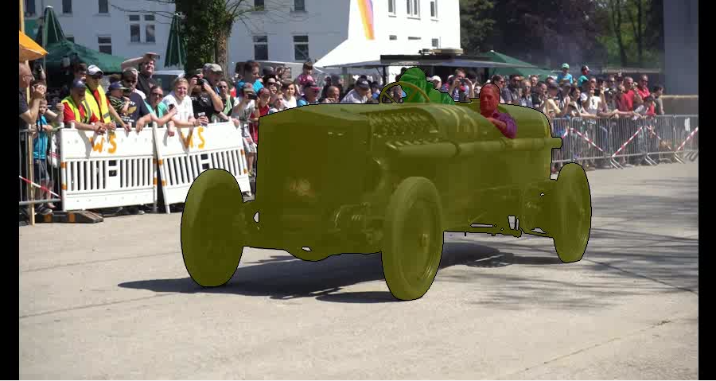

# supervisely_assignment

## Dev installation
- Create and activate environment.
- Launch `pip install -e \."[dev,tests]"` (zsh) `pip install -e [dev,tests]` (bash)

# Split and Merge
[Little report](src/module/scripts/splitmerge/README.md)

This module contains 2 main files: [`split.py`](src/module/scripts/splitmerge/split.py), [`merge.py`](src/module/scripts/splitmerge/merge.py)

## Split image function

```
Args:
  img_path (Union[str, Path]): path to image
  win_shape (Tuple[ShapeT, ShapeT]): sliding windows shape (height, width)
  shift_shape (Tuple[ShapeT, ShapeT]): shift shape (y-shift, x-shift)
  out_path (Union[str, Path]): folder where to save;
      splits will be placed into subfolder if image name
```


This function uses a sliding window to divide the image `img_name.*` into equal-size parts and saves them in the specified folder. All pieces names save information regarding splitting parameters such as sliding window size, shift parameters, image name, and the position of the piece's top right pixel on the original image.

To avoid colour fading due to compression (for example, in '.jpg' formats), pieces are saved as '.png' pictures.

To obtain raw splits without saving, feel free to use the `split_generator` function.

If the image cannot be divided evenly, the final component will have a different overlap: the last item in a row/column will always have picture pixels on the right/bottom.


## Merge image function

```
Args:
  splits_path (PathT): folder with splits
  save_path (PathT): path to save restored image
  original (Optional[PathT], optional): original image for comparison.
      Defaults to None.
  img_format (str): Save format.
      Image may changes after being saved
      due to compression. To avoid this use .png.
      Defaults to "png".
```

This function reconstruct image after splitting. All pieces should be named in fromat `{name}_win_{hw}_{ww}_sh_{hs}_{ws}_pos_{yi}_{xi}.png`, where `(hw, ww)` sliding window height and width, `(hs, ws)` shift parameters for y and x, `(yi, xi)` position of the piece's top right pixel on the original image.

If the width/height of the sliding window is greater than the width/height of the shift, an error will be raised due to the inability to reconstruct.


# DAVIS merge script
[Little report](src/module/scripts/davis_merge/README.md)

## Merge script
```
usage: merge_davis [-h] [--wks WKS] [--fr FR] [--alpha ALPHA] [--thck THCK] images annotations savepath name

positional arguments:
  images         folder with subfolders containing images
  annotations    folder with subfolders containing annotations
  savepath       path to save
  name           name of final video

optional arguments:
  -h, --help     show this help message and exit
  --wks WKS      number of subprocess for parallel image annotation; defaults to 1
  --fr FR        framerate; defaults to 15
  --alpha ALPHA  transperancy factor for annotation; defaults to 0.5
  --thck THCK    annotation border thickness; defaults to 1
```

Module have 3 main files [`annotation.py`](src/module/scripts/davis_merge/annotation.py), [`merge_script.py`](src/module/scripts/davis_merge/merge_script.py), [`videomaker.py`](src/module/scripts/davis_merge/videomaker.py) and the entrypoint [`__main__.py`](src/module/scripts/davis_merge/__main__.py).

### Annotaion
File content feature for adding per-frame annotations. 
- `add_annotation_on_image` add given annotation to image, adding border to annotation. Annotation transparency is set by parameter `alpha`.
- `annotate_image_sequence` add annotaion to sequence of images. All images in final list will be sorted by name.

### Videomaker
The file includes functions for generating video from a picture sequence. If the image sizes mismatch, a border will be added. 

### Merging
The file includes functions for generating video using DAVIS dataset photos.
Because of the dataset folder structure, these functions are unique to the DAVIS dataset.

### Entry point
DAVIS dataset merging script. Employ subprocesses to process multiple image sequences concurrently.

## Example
Clickable image.
[](https://drive.google.com/file/d/1ccyOrO386El73O34CmxcsDpJTTuIsruq/view?usp=share_link)


# CV
IN PRODUCTION
<!-- - rembg странности с зависимостями при установке
- backgroundremover плохой код библиотеки с циклическими импортами. Из-за чего невозвожно без ручного переделывания заставить библиотеку работать. -->