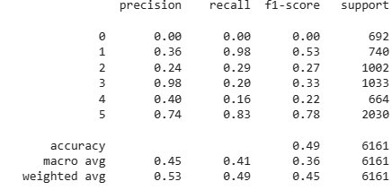
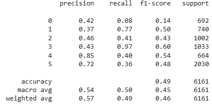
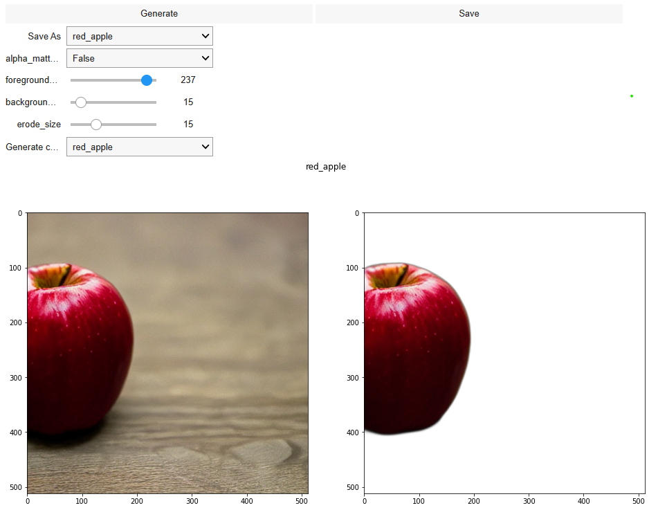
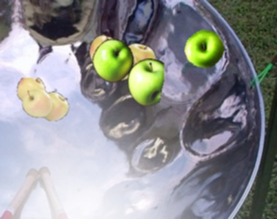
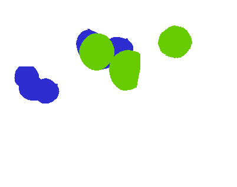

# Motivation of 3-part sructure
The main goal of experiments is to find the best way to create images for a synthetic set of data. 
We will compare experiments using the classification's quality on real data as a metric. 
All parts (except generation model) should be deterministic for this reason.

[Image constructor](utils/constructor.py) can be configurate with GenParams class. It contains local numpy random generator with fixed seed.

# Primitives generation
## Model
Of the proposed SOTA solutions the choice fell on Diffusion models. 
The main constraint was a shortage of PC (colab) capacity. 
So StableDiffusion 1.4 was chosen.
This approach is advantageous because, in addition to being resource-efficient, it accommodates a variety of generations (text2image, image2image).

## Separation
In practice, choosing the right prompts for even the production of basic primitives, like apples, is difficult.
As a result, backgrounds and primitives are generated/seek independently.
One of the advantages of this approach is the ability to automatically create annotation for segmentation tasks.

## Text2Img
Pros:
- a variety of generated primitives;

Cons:
- difficulty in the selection of good promts;

## Img2Img with text prompts
Pros:
- easier to choose the right prompt;

Cons:
- low variability of generated images (even at high "temperatures");
- need more time to select images for prompts;

# Results
Both classification models trained on Text2Img and Img2Img primitives show pure results on real data, however Text2Img generated more diversified primitives. Therefore, despite the small number of primitives, the per-class metrics turned out to be a little better.

Img2Img:

Text2Img:

## Examples
Generation UI:

Generated image:

Annotation:

# Conclusion
A pipeline has been created to test picture creation models.
It is simple to use and allows experiments to simply switch one generation model with another.

I received mediocre results due to a small number of experiments (the most of my effort was focused on infrastructure building).
Nonetheless, there are some suggestions for how to enhance it:

- try another generation models;
- increase number of base primitives;
- play with backgounds (they were picked once and never changed);
- investigate real data in greater depth; because I am unable to correctly define some sorts of apples on my own, this produces bias during generation process and marking.
